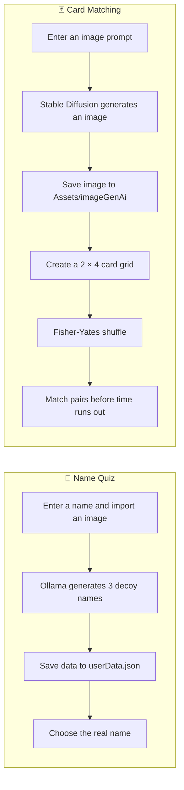

<div align="center">

# 🧠 Unity Play to Memorize

### An AI-assisted memory game built with Unity, Ollama, and Stable Diffusion

<p>
  
  
  
  
  
</p>

**Generate names. Create images. Test your memory.**

This project combines a name-recognition quiz with a classic card-matching game.  
The content is generated locally instead of being hardcoded.

</div>

---

## ✨ What the Project Does

The project contains two independent AI-assisted gameplay loops:

| Mode | Player input | AI service | Generated output | Gameplay |
|---|---|---|---|---|
| **Name Quiz** | A name and imported reference image | Ollama using `openchat` | Three similar decoy names | Choose the real name from four options |
| **Card Matching** | A text image prompt | Stable Diffusion WebUI | A generated image | Match pairs before the timer ends |

The matching game reads images from `Assets/imageGenAi/`, regardless of whether they were produced during a quiz session or generated separately.

---

## 🔄 How It Works



---

## 🎮 Main Features

- AI-generated decoy names using a local Ollama model
- AI-generated card artwork using Stable Diffusion
- Multiple-choice name recognition gameplay
- Classic flipping card-matching mechanics
- Fisher-Yates card shuffling
- Countdown timer
- Local JSON data storage
- Image importing through the Unity Editor
- Fully local AI workflow

---

## 🛠️ Tech Stack

| Technology | Purpose |
|---|---|
| **Unity** | Game engine and editor |
| **C#** | Game logic and API integration |
| **TextMeshPro** | User-interface text |
| **Ollama** | Local language-model inference |
| **Stable Diffusion WebUI** | Local image generation |
| **Newtonsoft.Json** | JSON serialization |
| **Mermaid** | README workflow diagram |

---

## ✅ Requirements

The following services must be running locally while the game is open in Unity:

| Dependency | Used by | Default endpoint |
|---|---|---|
| [Ollama](https://ollama.com/) with `openchat` | Name Quiz | `http://localhost:11434` |
| [AUTOMATIC1111 Stable Diffusion WebUI](https://github.com/AUTOMATIC1111/stable-diffusion-webui) with `--api` | Card Matching | `http://127.0.0.1:7860` |

> [!IMPORTANT]
> The game depends on local AI services. Start Ollama and Stable Diffusion before testing the related game mode.

---

## 🚀 Getting Started

### 1. Clone the repository

```bash
git clone https://github.com/YOUR_USERNAME/YOUR_REPOSITORY.git
cd YOUR_REPOSITORY
```

Replace `YOUR_USERNAME` and `YOUR_REPOSITORY` with your GitHub details.

### 2. Pull the Ollama model

```bash
ollama pull openchat
```

### 3. Start Stable Diffusion with API access

**Windows**

```bat
webui-user.bat --api
```

**macOS or Linux**

```bash
./webui.sh --api
```

### 4. Open the project in Unity

Open the project through Unity Hub using the Unity version recorded in:

```text
ProjectSettings/ProjectVersion.txt
```

### 5. Generate game content

Use the Name Quiz or image-generation screen to create local data.

The matching game needs at least **four unique images** inside:

---

## 🔐 Privacy

All language-model and image-generation requests are intended to run locally.

No cloud AI service is required by the current setup.

---

<div align="center">

### ⭐ Built as a Unity, C#, and local-AI portfolio project

Made with Unity, Ollama, and Stable Diffusion.

</div>
